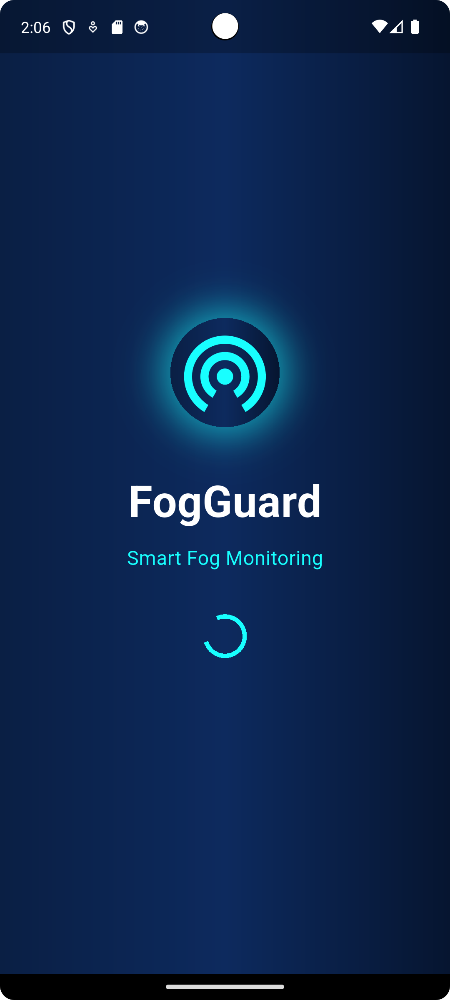
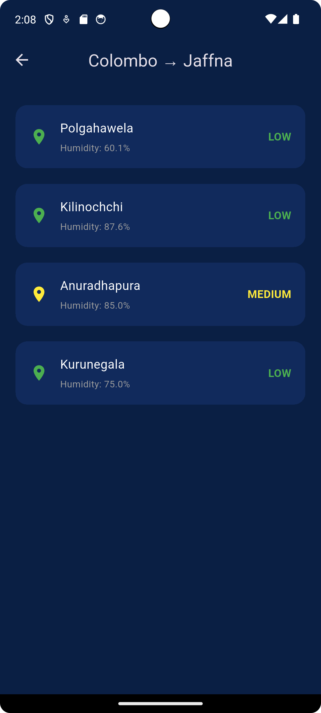
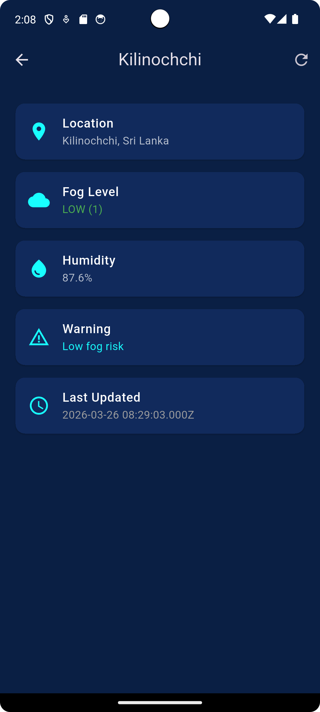
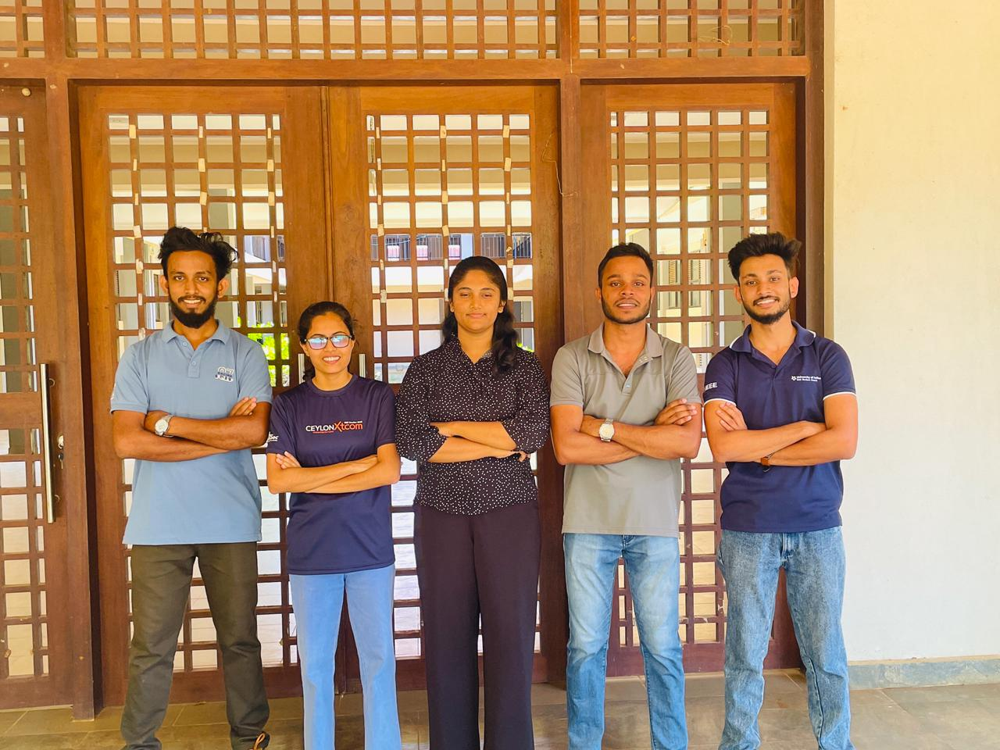

# FogGuard: Roadside Fog Density Monitoring & Accident Prevention System

<br><br>

<br><br>


## EC6020 Mini Project

**Degree Program:** Electronics and Computer Engineering  
**Project Type:** Hardware-Software Integrated Embedded System

---


## 📚 Table of Contents

- [Project Overview](#-project-overview)
- [Project Objectives](#-project-objectives)
- [Key Features](#-key-features)
- [Fog vs Dust Discrimination](#-fog-vs-dust-discrimination)
- [Field Calibrated Fog Detection Model](#-field-calibrated-fog-detection-model)
- [Repository Structure](#-repository-structure)
- [System Architecture](#-system-architecture)
- [Hardware Components](#-hardware-components)
- [Software Components](#-software-components)
- [Mobile Application](#-mobile-application)
- [Firebase Database Structure](#-firebase-database-structure)
- [Circuit Design](#-circuit-design)
- [Full Setup](#full-setup)
- [How It Works](#-how-it-works)
- [Setup Instructions](#-setup-instructions)
- [Project Status](#-project-status)
- [Contribution of Team Members](#-contribution-of-team-members)
- [Embedded Implementation Challenges](#-embedded-implementation-challenges) 
- [References](#-references)
- [License](#-license)
- [Acknowledgment](#-acknowledgment)
- [Contact](#-contact)


---

## 📌 Project Overview

FogGuard is an **embedded systems-based roadside monitoring solution** developed to address the increasing risk of road accidents caused by low visibility conditions due to fog. This issue is particularly critical in **mountainous regions, high-altitude roads, and routes with sharp bends and slopes**, where sudden fog formation significantly reduces driver visibility and reaction time.

In such environments, drivers often face dangerous situations where they are forced to **slow down abruptly or even stop and wait until visibility improves**, leading to traffic disruptions and increased accident probability.

FogGuard provides a **proactive and intelligent solution** by enabling real-time monitoring of fog conditions using a combination of **optical sensing (IR attenuation)** and **environmental sensing (humidity)**. The system is built around the **ATmega328P microcontroller**, ensuring efficient real-time data processing within embedded system constraints. Fog data is transmitted over long distances using **LoRa communication**, making it suitable for remote roadside deployment.

To enhance accessibility, an **ESP8266 module enables IoT connectivity**, allowing fog condition data to be uploaded to a cloud database and accessed through a mobile application. This allows users to **check road conditions remotely before starting a journey or while planning a route**, enabling informed decision making and improved travel safety.

By integrating embedded sensing, long-range communication, and cloud-based monitoring, FogGuard offers a **scalable, low-cost, and practical solution** for reducing fog related accidents and enhancing road safety.

---

## 🎯 Project Objectives

The primary objective of the FogGuard system is to design and implement an **embedded roadside fog monitoring solution** that enhances road safety through real-time environmental awareness.

### 🔹 Specific Objectives

* Develop an embedded system using **ATmega328P** for real-time fog detection
* Measure fog density using **IR-based optical sensing and humidity analysis**
* Implement a **fog classification algorithm** based on field-calibrated thresholds
* Enable long-range communication 
* Integrate cloud-based data transmission
* Provide real-time fog condition updates through a **mobile application**
* Design and fabricate **custom PCBs** for transmitter and receiver units
* Ensure reliable operation under **real-world environmental conditions**

### 🎯 Overall Goal

To provide a **low-cost, scalable, and practical system** that allows users to monitor fog conditions **before and during travel**, improving decision-making and reducing accident risks.

---

## 🚀 Key Features

* 🌫️ Real-time fog detection using IR and humidity sensing
* 🧠 Sensor fusion to distinguish fog from dust
* 📡 Long-range communication via LoRa
* ⚙️ Embedded processing using ATmega328P
* ☁️ IoT integration with ESP8266 and Firebase
* 📱 Mobile app for remote monitoring
* 🚦 Local alerts using LEDs and LCD
* 🔌 Custom PCB-based implementation

---

## 🔍 Fog vs Dust Discrimination

One of the key challenges in optical fog detection is distinguishing **fog from dust or other airborne particles**, as both can cause attenuation of light signals.

To address this, FogGuard employs a **dual-sensor fusion approach**:

* **IR Sensor (Emitter + Receiver):**
  Measures light attenuation caused by particles in the air

* **DHT22 Sensor:**
  Measures environmental humidity

### 🧠 Design Insight

* **Fog Conditions:**

  * High humidity
  * Significant IR attenuation

* **Dust Conditions:**

  * Low humidity
  * May still cause IR attenuation

### ✅ Solution Strategy

FogGuard combines both parameters to improve detection accuracy:

* High IR attenuation **+ high humidity → Fog**
* High IR attenuation **+ low humidity → Dust / Non-fog condition**

### 🎯 Significance

This approach:

* Reduces false detection caused by dust or smoke
* Improves reliability of fog classification
* Demonstrates effective use of **sensor fusion in embedded systems**

By integrating environmental context (humidity) with optical sensing, the system achieves **more robust and realistic fog detection**

---


<br>

## 📊 Field Calibrated Fog Detection Model

<br>


To ensure real-world accuracy, fog classification thresholds were derived through **field experiments conducted near Iranamadu Tank, Kilinochchi**.

### 📊 Observations

* Low fog conditions were observed when:

  * Humidity < 85%
  * IR sensor value > 9

* Medium fog conditions:

  * Humidity between 85% – 95%
  * IR values between 4 – 9

* High fog conditions:

  * Humidity > 95%
  * IR value < 4

### 📈 Final Model

| Fog Level | Humidity (%) | IR Value |
| --------- | ------------ | -------- |
| Low       | < 85         | > 9      |
| Medium    | 85 – 95      | 4 – 9    |
| High      | > 95         | < 4      |


---

## 📂 Repository Structure

The repository is organized to clearly separate **documentation, hardware design, embedded firmware, and mobile application components**.

```
Roadside-Fog-Density-Monitoring-system/
│
├── docs/
│   ├── pdf/            
│   ├── presentation/
│   ├── video/
│   └── image/              
│
├── PCB/
│   ├── transmitter/          
│   └── receiver/   
│
├── firmware/
│   ├── transmitter/       
│   ├── receiver/         
│   └── esp8266/
│
├── simulations/
│   ├── Receiver.pdsprj/          
│   └── Transmitter.pdsprj/
│
├── app/
│   └── fogguard_app/    
│
├── README.md             
└── .gitignore
```

---

## 🧠 System Architecture


```
 [ Sensors (IR + DHT22) ]
            ↓
      [ ATmega328P ]
            ↓
   ┌───────────────┐
   │   LoRa TX     │────────────▶ LoRa RX ──▶ [ Receiver Node (LCD + LEDs) ]
   └───────────────┘
            ↓
     [ ESP8266 WiFi ]
            ↓
      [ Firebase DB ]
            ↓
 [ Mobile App (Flutter) ]
```

---

## 🧩 Hardware Components

### 🔹 Transmitter Unit

* ATmega328P Microcontroller
* IR Emitter + Receiver (Fog Detection)
* DHT22 Humidity Sensor
* LoRa RA-02 Module
* ESP8266 WiFi Module
* Custom Designed PCB

### 🔹 Receiver Unit

* ATmega328P Microcontroller
* LoRa RA-02 Module
* I2C LCD Display (16x2)
* LED Indicators (Green, Yellow, Red)
* Custom PCB

---

## 💻 Software Components

| Component         | Technology                 |
| ----------------- | -------------------------- |
| Embedded Firmware | C code                     |
| Mobile App        | Flutter                    |
| Cloud Database    | Firebase Realtime Database |
| Version Control   | Git & GitHub               |

---

## 📱 Mobile Application

The FogGuard mobile application provides a **user-friendly interface** for monitoring real-time fog conditions from remote locations.

It allows users to:

* View fog levels and humidity data
* Select routes and monitor specific locations
* Receive safety indications before and during travel

The application retrieves live data from the **Firebase cloud database**, enabling users to make informed decisions and plan safer journeys.

The mobile app functions as a **visualization layer**, while core processing is handled by the embedded system.

### 📸 App Interface
<br>
<p align="center">
   &nbsp;&nbsp;&nbsp;&nbsp;
   &nbsp;&nbsp;&nbsp;&nbsp;
   &nbsp;&nbsp;&nbsp;&nbsp;
  
</p>

---

## 🧩 Firebase Database Structure

```
fog_nodes/
   └── kilinochchi/
         ├── name
         ├── location
         ├── fogLevel
         ├── humidity
         ├── warning
         └── lastUpdated
```
## 🧩 Circuit Design

<br>
1.Schematic Design<br>
&nbsp; 
<table align="center">
  <tr>
    <td align="center" style="padding-right: 40px;">
      <br>
      <b>Transmitter schematic diagram</b>
    </td>
    <td align="center">
      <br>
      <b>Receiver schematic diagram</b>
    </td>
  </tr>
</table>

<br>
2.PCB Design<br>
&nbsp; 
<table align="center">
  <tr>
    <td align="center" style="padding-right: 40px;">
      <br>
      <b>Transmitter PCB Design</b>
    </td>
    <td align="center">
      <br>
      <b>Receiver PCB Design</b>
    </td>
  </tr>
</table>
<br>
3.Fabricated PCB Board<br>
&nbsp; 
<table align="center">
  <tr>
    <td align="center" style="padding-right: 40px;">
      <br>
      <b>Transmitter Fabricated PCB Board </b>
    </td>
    <td align="center">
      <br>
      <b>Receiver Fabricated PCB Board</b>
    </td>
  </tr>
</table>
<br>
3.Modules<br>
&nbsp; 
<table align="center">
  <tr>
    <td align="center" style="padding-right: 40px;">
      <br>
      <b>Transmitter Module </b>
    </td>
    <td align="center">
      <br>
      <b>Receiver Module</b>
    </td>
  </tr>
  <td align="center">
      <br>
      <b>Sensors Module</b>
    </td>
  </tr>
</table>
<br>

<br>

---
## Full Setup
&nbsp; 
<table align="center">
  <tr>
    <td align="center" style="padding-right: 40px;">
      <br>
      
    
  </tr>
</table>

---

## 🔧 How It Works
<br>

1. Sensors detect fog density and humidity levels
2. ATmega processes data and classifies fog level
3. Data is transmitted via LoRa to nearby receiver units
4. ESP8266 sends data to Firebase cloud
5. Mobile app retrieves and displays real-time data
6. Drivers receive alerts and make safer decisions

---

## 🔧 Setup Instructions

### 🔹 Hardware

* Assemble transmitter and receiver circuits
* Verify all SPI and UART connections

### 🔹 Firmware

* Upload transmitter and receiver code
* Upload ESP8266 code separately

### 🔹 Mobile App

```bash
flutter pub get
flutter run
```

### 🔹 Firebase

* Create Realtime Database
* Configure read/write rules
* Update database URL in app

---

## 📊 Project Status

* ✅ Hardware Design & implementation Completed (PCB vFinal)
* ✅ LoRa Communication Working
* ✅ Firebase Integration Completed
* ✅ Mobile App UI Completed

---
## 📊 Contribution of Team Members


<br>
&nbsp; 
<table align="center">
  <tr>
    <td align="center" style="padding-right: 40px;">
      <br>
      <b>Team FogGuard</b>
      
    
  </tr>
</table>
<br>

| Task | MADUSHANKA W.N.L. | WANNINAYAKA W.M.I.M. | LIYANAGE L.D.R.K. | LIYANAWATHTHAGE L.B.K. | DE COSTA M.S.M. |
|------|-------------------|----------------------|-------------------|-------------------------|-----------------|
| Documentation |  | ✅ | ✅ |  |  |
| Schematic Design | ✅ | ✅ | ✅ | ✅ | ✅ |
| Microcontroller and ESP8266 coding |  | ✅ | ✅ | ✅ | ✅ |
| Breadboard Prototyping | ✅ | ✅ | ✅ | ✅ | ✅ |
| PCB Design | ✅ |  |  | ✅ | ✅ |
| PCB Fabrication |  |  |  | ✅ | ✅ |
| Sensor Calibration | ✅ |  |  | ✅ | ✅ |
| Mobile Application Design |  |  |  | ✅ |  |
| Testing and Validation | ✅ | ✅ | ✅ | ✅ | ✅ |
| GitHub Repository Maintenance |  |  |  | ✅ | ✅ |
| Final Assembly and Setup | ✅ | ✅ | ✅ |  |  |

<br>


## 🎓 Mentors

We would like to express our sincere gratitude to our mentors for their valuable guidance, continuous support, and encouragement throughout the development of this project.
<br><br>
| Name | Designation | Department |
|------|-------------|------------|
 Dr. Thanuja Uruththirakodeeswaran | Academic Supervisor | Department of Computer Engineering |
| Eng. Pirunthapan Yogathasan | Supervisor | Department of Computer Engineering |

<br>
Their expertise, advice, and feedback greatly contributed to the successful completion of this project.


---

## 🧠 Embedded Implementation Challenges

### System Integration Constraints

The FogGuard system integrates multiple modules including **LoRa communication, ESP8266 IoT interface, and sensor-based detection**, all within an embedded environment. This introduced several practical limitations:

* LoRa communication instability during initial configuration
* Difficulty in selecting appropriate antennas for reliable long-range transmission
* Challenges in establishing consistent cloud communication
* Requirement of separate firmware for ESP8266 to handle IoT data uploading

---

### Solution Strategy

To address these challenges:

* LoRa parameters such as frequency and configuration settings were carefully tuned to ensure stable communication
* Suitable antennas were tested and optimized to improve signal strength and transmission reliability
* Cloud integration was restructured by transitioning to Firebase and refining data handling methods
* A dedicated firmware was developed for the ESP8266 module to reliably read serial data and upload it to the cloud

---
<br>

## 📚 References

The following resources and technologies were used in the design and development of the FogGuard system:

### 🔧 Embedded Systems & Hardware

* ATmega328P Microcontroller – https://www.microchip.com/en-us/product/atmega328p
* LoRa Communication (SX1278 / RA-02) – https://www.semtech.com/lora
* ESP8266 WiFi Module – https://www.espressif.com/en/products/socs/esp8266

---

### 🛠️ Design & Simulation Tools

* EasyEDA (PCB Design) – https://easyeda.com
* Proteus Design Suite (Simulation) – https://www.labcenter.com

---

### 💻 Software & Development

* Arduino IDE – https://www.arduino.cc/en/software
* Flutter (Mobile App Development) – https://flutter.dev
* Android Studio – https://developer.android.com/studio

---

### ☁️ IoT & Cloud Services

* Firebase Realtime Database – https://firebase.google.com


---

## 📜 License
<br>

This project is developed for academic and research purposes.

---

## 🌟 Acknowledgment

This project was developed as part of an embedded systems to improve road safety through smart technology.

---

## 📬 Contact

For inquiries or collaboration opportunities, feel free to reach out.

---

> ⚡ *FogGuard – Enhancing Road Safety Through Smart Monitoring*
